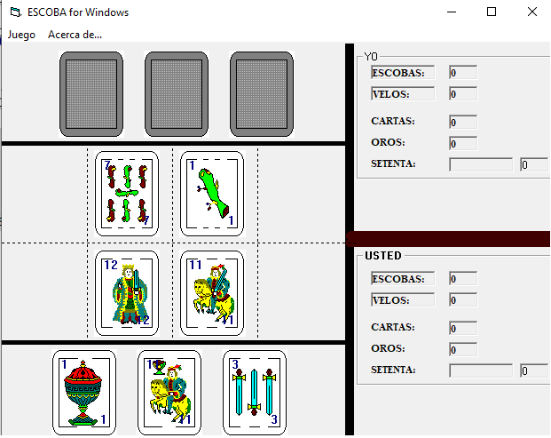
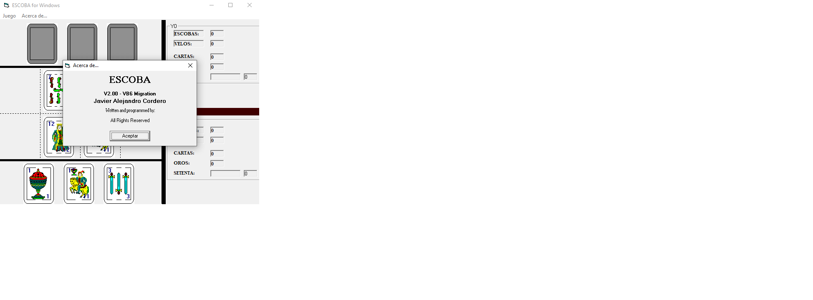
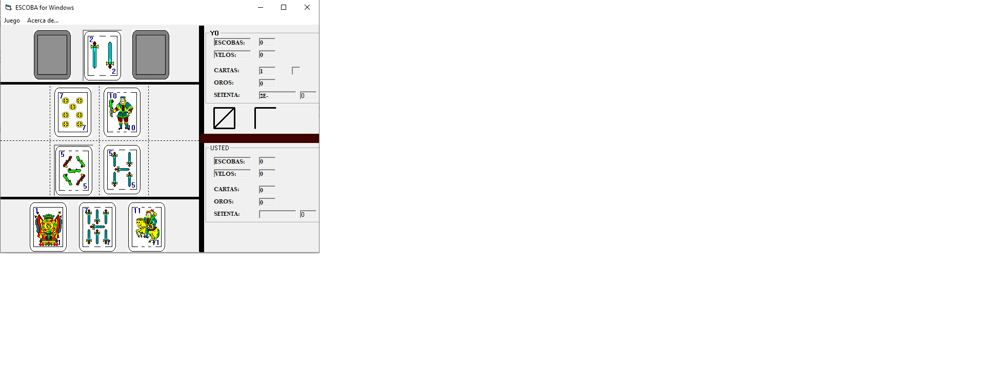

# Escoba de 15 - Visual Basic 6 (1994)

*[Read in English](README_EN.md)*

Juego de Escoba de 15 con baraja espanola, escrito en Visual Basic por **Javier Alejandro Cordero**. Originalmente desarrollado en VB3 (~1994), luego migrado a VB6 (V2.00).


## Screenshots

| Inicio de partida | Acerca de | Partida en juego |
|---|---|---|
|  |  |  |

## Sobre el juego

Escoba de 15 contra la computadora, con interfaz grafica Windows y baraja espanola completa (40 cartas en BMP).

- **IA con backtracking recursivo**: la computadora busca combinaciones de cartas que sumen 15 usando un algoritmo recursivo con backtracking
- **Prioriza los velos**: la IA sabe que el 7 de oro, As de oro y 12 de oro son las cartas mas valiosas y las busca primero
- **Scoring completo**: escobas, velos, cartas, oros y setenta (carta mas alta por palo)
- **Indicadores en tiempo real**: muestra quien va ganando cada categoria mientras se juega
- **Sonido generado por codigo**: genera ondas de sonido WAV en memoria (sin archivos de audio externos), construyendo el header RIFF/WAV byte por byte con ondas seno
- **Graficos**: 40 imagenes BMP de cartas espanolas dibujadas a mano
- **Partida a 15 puntos** con deteccion de empate

## Como jugar

### Controles

- **Click** en una carta propia para seleccionarla (borde resaltado)
- **Click** en cartas de la mesa para agregarlas a la suma (deben sumar 15 con tu carta)
- **Doble click** en tu carta seleccionada para tirarla a la mesa (cuando no podes levantar)
- **F2**: Juego nuevo
- **Ctrl+S**: Salir

### Reglas de la Escoba de 15

1. Se reparten 3 cartas a cada jugador y 4 a la mesa
2. En tu turno, elegis una carta y levantas de la mesa las que sumen 15 con ella
3. Si no podes sumar 15, tiras una carta a la mesa
4. Si al levantar la mesa queda vacia, es **escoba** (1 punto extra)
5. Al terminar el mazo, el ultimo en levantar se lleva las cartas restantes

### Puntuacion

| Categoria | Puntos |
|-----------|--------|
| Escobas | 1 por cada escoba |
| Velos (7, As y 12 de oro) | 1 por cada velo |
| Mas cartas | 1 punto |
| Mas oros | 1 punto |
| Setenta (mayor suma de carta mas alta por palo) | 1 punto |

## Estructura del proyecto

```
ESCOBAFR.frm    - Formulario principal y logica del juego (~1800 lineas)
CARTAS.bas      - Modulo de cartas: nombres de archivo, numeros y palos
SOUNDFX.bas     - Generacion de sonido WAV en memoria (sin archivos externos)
ESPERA.bas      - Funcion de espera no-bloqueante con DoEvents
VER.frm         - Dialogo "Acerca de"
ESCOBA.vbp      - Proyecto Visual Basic 6
ESCOBA.exe      - Ejecutable compilado
*.BMP           - 40 cartas espanolas + reverso (ATRAS.BMP)
```

## Aspectos tecnicos destacados

- **Backtracking recursivo** (`buscar_combinacion`): algoritmo que explora todas las combinaciones posibles de cartas en la mesa para encontrar las que sumen el objetivo. Usa recursion con backtracking, marcando y desmarcando cartas.
- **Generacion de audio programatica** (`SOUNDFX.bas`): construye archivos WAV en memoria, generando el header RIFF byte por byte y llenando las muestras con ondas seno. Usa `PlaySound` de winmm.dll con `SND_MEMORY`. Incluye click, error, atencion (escoba) y sirena.
- **Valoracion inteligente de cartas** (`VALECOMP`): la IA prioriza velos (valor 0 = nunca tirar), luego 7s (valor 1), y ordena el resto para decidir cual descartar.
- **Calculo de setenta**: rastrea la carta mas alta (<=7) de cada palo para ambos jugadores en tiempo real.

## Contexto historico

Este juego fue escrito originalmente en Visual Basic 3 alrededor de 1994, y luego migrado a Visual Basic 6. Representa la evolucion del autor desde QBasic/DOS (donde escribio un [juego de Truco en 1992](https://github.com/jacinside/truco-qbasic-1992)) hacia la programacion visual en Windows. Las cartas espanolas fueron dibujadas como bitmaps individuales.

## Licencia

MIT License - Copyright (c) 1994 Javier A. Cordero. Ver [LICENSE](LICENSE).
